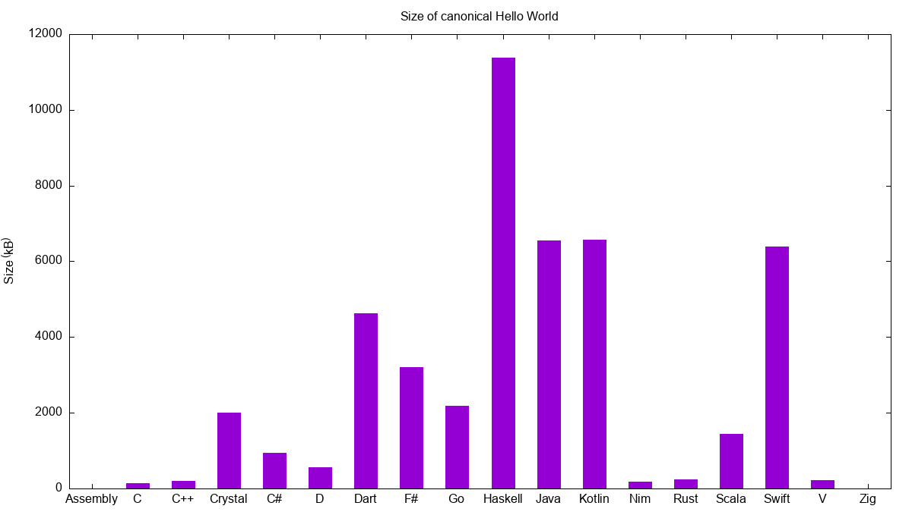

# sizegame

This repo consists of a set of canonical hello world programs in multiple languages and a GitHub action that compiles them and summarizes the size information.

Everything is open source - inspect how the data is generated by the GitHub Action by looking at the [action definition](.github/workflows/ci.yml) and inspecting the logs.

# Round 2 results

Round 2 was [carried out](https://github.com/MichalStrehovsky/sizegame/actions/runs/5035954920) on May 21 2023. Binaries are [here](https://github.com/MichalStrehovsky/sizegame/releases/tag/round-002).

Rank | Language | Size (kB) | Compiler | Notes
---- | -------- | ---- | -------- | -----
1 | Assembly | 2 | Microsoft Macro Assembler Version 14.36.32532.0 |  
2 | Zig | 5 | 0.11.0-dev.3222+7077e90b3 |  
3 | C | 135 | Microsoft C/C++ Optimizing Compiler Version 19.36.32532 for x64 |  
4 | Nim | 161 | Nim Compiler Version 1.6.12 [Windows: amd64] |  
5 | C++ | 230 | Microsoft C/C++ Optimizing Compiler Version 19.36.32532 for x64 |  
6 | Rust | 254 | rustc 1.69.0 (84c898d65 2023-04-16) |  
7 | Kotlin | 665 | kotlinc-native 1.18.10 |  
8 | C# | 1234 | 8.0.100-preview.4.23260.5 |  
9 | Scala | 1434 | Scala 3.2.2 Scala-native 0.4.10 |  
10 | Go | 1928 | go version go1.20.4 windows/amd64 |  
11 | F# | 3303 | 8.0.100-preview.1.23115.2 |  
12 | Dart | 4669 | Dart SDK version: 3.0.1 (stable) (Tue May 16 11:57:19 2023 +0000) on "windows_x64" |  
13 | Swift | 6093 | compnerd.org Swift version 5.8 (swift-5.8-RELEASE) | Includes: swiftCore.dll, vcruntime140.dll, vcruntime140_1.dll, msvcp140.dll 
14 | Haskell | 11409 | The Glorious Glasgow Haskell Compilation System, version 9.6.1 |  
15 | Java | 11606 | GraalVM 22.3.2 Java 17 CE (Java Version 17.0.7+7-jvmci-22.3-b18) | Includes vcruntime140.dll 

## Rules

1. The program should be compiled ahead of time. Languages that are jitted/interpreted by default should be compiled ahead of time the canonical way.
2. The program should print Hello World the idiomatic way, using the standard library that comes with the language. Ideally, use the same snippet found in the official introductionary tutorial for the language.
3. The program should be compiled using the default compiler settings.
   * You can enable optimizations if optimizations are not enabled by default. If the compiler has a master switch "enable optimizations", that switch should be used. If there are only more specialized switches (like in Zig), we have no option but to optimize for size, although the results are less representative of what is canonical.
4. The program should run on a vanilla OS install. Ideally, it should link non-OS dependencies statically. If that's not possible, the reported size _will include the size of all dynamic libraries not provided by a vanilla OS install_.

The motivation for these rules is simple - canonical hello world and canonical compiler settings measure the canonical user experience. All of the measured languages have ways to produce smaller Hello World. E.g. disabling textual backtraces in Go, not using the standard library in C, messing with linker switches for any of these, etc.

But - there is a reason why the language/compiler developers chose the defaults they chose - the defaults match what the language and standard library advertises. It is therefore an objective measure. If you disagree with what the defaults entail, please take it up with the compiler/language maintainers. This repo is not a place for this discussion.

Without these rules in place, this repo would just become a race to the bottom. We know someone made Rust compile to [464 bytes](https://github.com/mcountryman/min-sized-rust-windows). We know C# can compile to [a couple kilobytes](https://github.com/MichalStrehovsky/zerosharp). It is also not interesting because these solutions don't deliver on the language or standard library promises anymore. They're merely art projects. There's a lot of grey area in between, but the gray area is just a place for disputes.

## FAQ

### What conclusions can I make about language X from this?

The conclusion you can make is that Hello World done in a canonical way in language X compiled with canonical settings compiles to Y bytes. That's all there is to it.

### Do these programs perform the same thing? Is this bloat?

While it may appear that writing to console is a simple problem, it is actually quite complex. Writing can fail if the output is redirected to a file and there's no space on the target file system. On Windows, we have to deal with the active code page of the console. Some languages do console writing through stream abstractions. 

Writing to console is typically customized by the standard library to match the general developer expectations in the given language.

For example, while the size of Zig executable is impressive, if we swap the "Hello, World!" string with "Kŕdeľ ďatľov učí koňa žrať kôru", on my machine the Zig program would print the following text: "K┼òde─╛ ─Åat─╛ov u─ì├¡ ko┼êa ┼╛ra┼Ñ k├┤ru." (blasting UTF-8 somewhere that doesn't talk UTF-8) whereas C# (and possibly others) would write "Krdel datlov ucí kona zrat kôru." because they would do a lossy conversion to the console code page first. This is fine as long is matches the developer expectations.

Similarly, not all languages treat error conditions the same. If the OS is in a low memory situation, it may not be possible to convert the text to console code page. If stdout is redirected to a file and the disk is full, the standard library may need to raise an exception. Raising an exception may require printing a backtrace. All of these "cost" some size on disk. Some languages and standard libraries care about these things more than others. It doesn't come for free.
